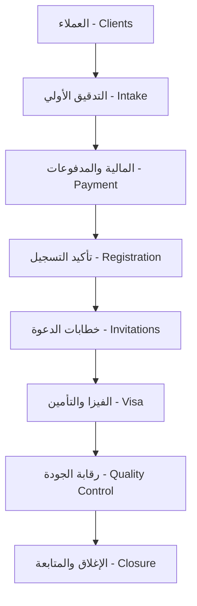

# دليل استخدام لوحة التحكم JAZ Admin (Dashboard Guide)

مرحباً بك في دليل لوحة تحكم منصة **JAZ (Joint Annual Zone)**. تم تصميم لوحة التحكم هذه لتكون المركز العصبي والتشغيلي للمنصة، حيث تتيح للمدراء (Admins) وأعضاء الفريق (Team Members) إدارة كافة الفعاليات، معالجة طلبات التسجيل، تصنيف ومتابعة المستندات، جدولة المهام، وإنشاء التصاميم بالذكاء الاصطناعي بكل سهولة وسلاسة.

---

## 📑 جدول المحتويات
1. [نظام الصلاحيات وإدارة الأدوار (RBAC)](#1-نظام-الصلاحيات-وإدارة-الأدوار-rbac)
2. [الهيكل العام وأقسام لوحة التحكم](#2-الهيكل-العام-وأقسام-لوحة-التحكم)
   - [أولاً: نظرة عامة (Overview)](#أولاً-نظرة-عامة-overview)
   - [ثانياً: إدارة الفريق والعمليات الميدانية (Team Operations)](#ثانياً-إدارة-الفريق-والعمليات-الميدانية-team-operations)
   - [ثالثاً: محطات المعالجة والعملاء (Application Operations)](#ثالثاً-محطات-المعالجة-والعملاء-application-operations)
   - [رابعاً: إدارة المحتوى والبيانات (Content Management)](#رابعاً-إدارة-المحتوى-والبيانات-content-management)
   - [خامساً: إعدادات النظام (System Settings)](#خامساً-إعدادات-النظام-system-settings)
3. [خطوات العمل التشغيلية النموذجية (Standard Workflows)](#3-خطوات-العمل-التشغيلية-النموذجية-standard-workflows)
   - [دورة حياة فعالية: من المسودة إلى النشر](#أ-دورة-حياة-فعالية-من-المسودة-إلى-النشر)
   - [دورة حياة الطلب: المعالجة عبر المحطات التشغيلية الثمانية](#ب-دورة-حياة-الطلب-المعالجة-عبر-المحطات-التشغيلية-الثمانية)
   - [إدارة صلاحيات الموظفين والمهام اليومية](#ج-إدارة-صلاحيات-الموظفين-والمهام-اليومية)
   - [توليد تصاميم الفعاليات عبر استوديو التصاميم](#د-توليد-تصاميم-الفعاليات-عبر-استوديو-التصاميم)

---

## 1. نظام الصلاحيات وإدارة الأدوار (RBAC)

تعتمد لوحة التحكم على نظام أمني صارم لإدارة الوصول القائم على الأدوار (Role-Based Access Control). يتم تعريف الصلاحيات مركزياً في الملف [permissions.ts](file:///Users/hasanainalmazrai/Desktop/ajz/lib/permissions.ts) ومحمية بالكامل عبر قواعد أمان الجداول (RLS) في قاعدة بيانات Supabase.

### **الأدوار المتاحة (Roles):**
1. **مدير النظام (Admin):**
   - يمتلك صلاحيات كاملة ومطلقة للوصول إلى جميع الصفحات، تعديل البيانات، إضافة الموظفين، التحكم بصلاحياتهم، والموافقة على طلبات التعديل الحساسة.
2. **عضو الفريق (Team Member):**
   - دور مقيد مصمم لموظفي العمليات. لا يمكنه الدخول إلا للصفحات التي يتم منحها له صراحةً من قبل المدير عبر صفحة إدارة الفريق.
   - إذا لم تُحدد له صلاحيات بعد، يتم توجيهه افتراضياً إلى صفحة **المهام اليومية (Daily Tasks)** فقط.

### **كيفية عمل حماية المسارات:**
- بمجرد تسجيل الدخول، يتم التحقق من دور المستخدم وحالته (`is_active`). إذا تم إيقاف الحساب، يُسجل خروج المستخدم فوراً.
- يتم فلترة القائمة الجانبية (Sidebar) ديناميكياً لتظهر للموظف الروابط المسموح له بزيارتها فقط، مما يمنع التشتت ويمنع محاولات القفز إلى صفحات غير مصرح له بها.

---

## 2. الهيكل العام وأقسام لوحة التحكم

تنقسم لوحة التحكم إلى 5 مجموعات رئيسية تظهر في الشريط الجانبي:

### **أولاً: نظرة عامة (Overview)**

#### **1. لوحة العمليات التشغيلية (Operations Dashboard)**
- **المسار:** `/dashboard/home`
- **ماذا يوجد في الصفحة:**
  - **بطاقات الإحصائيات الفورية:** تعرض أرقاماً حية لـ (الطلبات المقدمة، مواعيد التأشيرات المتاحة، مسودات الفعاليات قيد التحضير، الموظفين النشطين، المهام المفتوحة، المهام المتأخرة المستحقة).
  - **رسم بياني دائري لحالات الطلبات (Applications Status):** يعكس نسب المعاملات في كل محطة (Draft, Under Review, Completed, etc.).
  - **رسم بياني لأعباء عمل الفريق (Workload Distribution):** يعرض بوضوح كمية المهام المنجزة والمفتوحة لكل موظف، لمساعدة المدير على توزيع العمل بعدالة.

#### **2. التحليلات الإحصائية (Analytics)**
- **المسار:** `/dashboard/analytics`
- **ماذا يوجد في الصفحة:**
  - مؤشرات أداء تفصيلية (KPIs) تشمل: الزوار الفريدين (Unique Visitors)، استعراضات الصفحات (Pageviews)، حجم التفاعلات، وعمليات البحث الأكثر شيوعاً.
  - فلاتر زمنية سريعة لفرز البيانات: (اليوم، آخر 7 أيام، آخر 30 يوماً).
  - جدول بالصفحات الأكثر زيارة ونسب التحويل من زائر إلى مسجل في فعالية.

---

### **ثانياً: إدارة الفريق والعمليات الميدانية (Team Operations)**

#### **1. المهام اليومية (Daily Tasks)**
- **المسار:** `/dashboard/team-tasks`
- **ماذا يوجد في الصفحة:**
  - **لوحة كانبان تفاعلية (Kanban Board):** مقسمة إلى ثلاثة أعمدة (Todo, In Progress, Done). يمكن سحب وإفلات المهام لتغيير حالتها فوراً.
  - **ميزة الإدخال الصوتي (Voice Input):** تتيح للموظف تسجيل الملاحظات وتفاصيل المهمة باستخدام الصوت مباشرة.
  - **إسناد المهام:** تحديد المسؤول عن المهمة، تاريخ الاستحقاق، مع وسم الأولوية.

#### **2. أعضاء الفريق (Team Members) — [للمدراء فقط]**
- **المسار:** `/dashboard/team`
- **ماذا يوجد في الصفحة:**
  - قائمة الموظفين النشطين وغير النشطين مع بيانات التواصل (الإيميل، الهاتف) وصورهم الرمزية (Avatars).
  - **إدارة الصلاحيات (Permissions Manager):** واجهة تحتوي على مربعات اختيار (Checkboxes) لجميع صفحات لوحة التحكم الـ 30+، تتيح للمدير تفصيل صلاحيات دقيقة جداً لكل موظف على حدة.
  - إحصائيات الأداء الفردي لكل موظف (المهام المنجزة، المهام المتأخرة، وتوقيت آخر نشاط له على النظام).

#### **3. ماسح جوازات السفر الذكي (Passport Scanner)**
- **المسار:** `/dashboard/passport-scanner`
- **ماذا يوجد في الصفحة:**
  - نافذة لرفع صورة جواز السفر (JPG / PNG) أو سحبها وإفلاتها.
  - **المعالجة بالتعرف الضوئي (OCR):** يقرأ النظام الجواز تلقائياً ويستخرج البيانات الأساسية بدقة (الاسم، اللقب، تاريخ الميلاد، رقم الجواز، دول الإصدار والجنسية، وتواريخ الإصدار والانتهاء).
  - **التحقق التلقائي لشروط شنغن:** يقوم النظام بذكاء بفحص التواريخ وإظهار تحذيرات فورية:
    - *تحذير خطير:* إذا كان الجواز منتهياً تماماً.
    - *تحذير منبه:* إذا كان الجواز سينتهي خلال أقل من 6 أشهر (توصية بالتجديد لأن شنغن تتطلب 3 أشهر صلاحية بعد تاريخ العودة).
    - *تحذير تنظيمي:* إذا تم إصدار الجواز قبل أكثر من 10 سنوات (مرفوض لدى قنصليات شنغن).
  - واجهة مقارنة الحقول النصية مع عرض صور مقصوصة (Crops) لكل حقل من الجواز الأصلي للتحقق البصري السريع، وزر نسخ البيانات الفوري لتسهيل ملء استمارات التقديم.

#### **4. طلبات التعديل (Change Requests) — [للمدراء فقط]**
- **المسار:** `/tasks`
- **ماذا يوجد في الصفحة:**
  - واجهة مراجعة التغييرات المقترحة على البيانات الحساسة أو إعدادات المنصة التي يرفعها أعضاء الفريق، لتمكين المدير من مراجعتها واعتمادها أو رفضها.

#### **5. استوديو التصاميم الذكي (Creative Prompts)**
- **المسار:** `/dashboard/creative-prompts`
- **ماذا يوجد في الصفحة:**
  - أداة متطورة تمكن موظفي التسويق والمحتوى من إنشاء نصوص أوامر تصاميم (Prompts) جاهزة للذكاء الاصطناعي (OpenAI DALL-E أو Google Gemini).
  - **تبويب إعدادات الهوية (Identity Settings):** لحفظ وتعديل دليل الهوية البصرية لـ JAZ (مثل ألوان الـ Brand Kit، الخطوط المعتمدة كـ IBM Plex Sans Arabic، نمط الصور كـ Institutional أو Corporate، نوع الخلفية، ومكان الشعار الافتراضي).
  - **تبويب إنشاء تصميم (Create Panel):**
    - اختيار الفعالية المراد الترويج لها (يسحب بياناتها تلقائياً كالعنوان والتاريخ والموقع).
    - تحديد نوع المنصة ومقاس التصميم (منشور إنستغرام 1:1، ستوري 9:16، غلاف فيسبوك، غلاف تيك توك، إلخ).
    - إدخال النصوص المراد ظهورها بالتحديد (Header, Subheader, Body, CTA, Footer).
    - الضغط على "إنشاء Prompt" للحصول على كود بصري وصفي دقيق مصمم خصيصاً للمودل المختار ومكتوب باللغة المحددة يضمن عدم تشويه النصوص أو إقحام أحرف عشوائية غريبة.

---

### **ثالثاً: محطات المعالجة والعملاء (Application Operations)**

لضمان معالجة خالية من الأخطاء لمعاملات الوفود والمشاركين، يتبع النظام خط معالجة تتابعي (Pipeline) مقسم إلى 8 محطات عمل متتالية. ينتقل الموظف بينها عبر القائمة الجانبية لمعالجة المعاملات التي تقع ضمن صلاحياته فقط.

#### **المسار الأساسي للمحطات:** `/dashboard/participation-cases/work`

1. **العملاء (Clients):**
   - استعراض شامل لملفات العملاء المسجلين والتحقق من حساباتهم.
2. **التدقيق الأولي (Intake):**
   - استلام الملفات المرفوعة حديثاً من المستخدمين والتحقق من اكتمال وجودة المستندات المطلوبة وصحتها.
3. **المالية والمدفوعات (Payment / Finance):**
   - مراجعة إيصالات السداد، تأكيد تسوية المبالغ المستحقة لرسوم المؤتمرات والفعاليات، وإصدار الفواتير المعتمدة.
4. **تأكيد التسجيل (Registration):**
   - تأكيد تثبيت المقعد للمشارك في الفعالية المحددة وإدراج اسمه رسمياً في قائمة الحضور.
5. **خطابات الدعوة (Invitations):**
   - توليد خطابات الدعوة الرسمية (Invitation Letters) الموجهة للوزارات أو السفارات أو الجهات المعنية لتسهيل حضور الوفود الدولية، وإرسالها لهم بصيغة PDF.
6. **الفيزا والتأمين (Visa & Insurance):**
   - التنسيق مع حجوزات مواعيد التأشيرات (الربط مع محرك حجز مواعيد الفيزا) وتأمين السفر وتحديث حالة الطلب القنصلي.
7. **رقابة الجودة (QC - Quality Control):**
   - محطة تدقيق صارمة للمراجعة البصرية والتدقيق النهائي على كافة الأوراق والتذاكر ومطابقتها للمرة الأخيرة قبل التسليم لمنع أي خطأ إداري.
8. **الإغلاق والمتابعة (Closure & Follow-up):**
   - أرشفة المعاملة بنجاح، وتهيئة نظام استبيانات تقييم التجربة والمتابعة بعد الفعالية.

#### **صفحات مكملة في هذا القسم:**
- **العملاء (Customers):** قاعدة بيانات تفاعلية لاستعراض وتعديل بيانات الاتصال بالعملاء وتاريخ مشاركاتهم الفعالة. (`/dashboard/customers`)
- **توفر التأشيرات (Visa Availability):** إدارة عدد المواعيد المتاحة لكل دولة وتحديثها الفوري حسب مواسم تقديم السفارات. (`/dashboard/visa-availability`)
- **مسودات الفعاليات (Draft Events):** استعراض ومراجعة الفعاليات التي لا تزال في مرحلة التحرير ولم تُنشر للعامة بعد لتعديلها وتدقيقها. (`/dashboard/draft-events`)

---

### **رابعاً: إدارة المحتوى والبيانات (Content Management)**

مجموعة من الصفحات الخدمية لإدارة وتغذية الموقع الإلكتروني وتطبيق الجوال بالبيانات:

- **الفعاليات المنشورة (Published Events - `/dashboard/events`):** إضافة الفعاليات الجديدة بالكامل، كتابة تفاصيلها بالعربية والإنجليزية، رفع الصورة البارزة (Cover), تحديد التواريخ، والموقع الجغرافي.
- **المقالات والأخبار (Articles / Blog - `/dashboard/blog`):** محرر متكامل لكتابة ونشر الأخبار، النشرات الرسمية، والمقالات الموجهة للجمهور.
- **الأقسام والقطاعات (Sectors - `/dashboard/sectors`):** إضافة وتعديل قطاعات العمل الاستراتيجية للمؤسسة.
- **الشركاء والجهات (Partners - `/dashboard/partners`):** مراجعة وإدارة طلبات الرعاية، الشركاء الاستراتيجيين، وطلبات انضمام الشباب لمبادرات JAZ Youth.
- **البرامج التدريبية (Training Programs - `/dashboard/trainings`):** إدارة وتحديث البرامج الأكاديمية والتدريبية التابعة للمنصة وتلقي طلبات الانضمام لها.
- **الروابط السريعة (Quick Links - `/dashboard/links`):** تعديل وتحديث روابط التواصل ومواقع الشركاء الملحقة في تذييل الموقع.
- **صندوق الرسائل (Messages - `/dashboard/messages`):** عرض رسائل البريد الإلكتروني والاتصالات الواردة من نموذج "اتصل بنا" الموجود في الموقع العام والرد عليها.
- **حسابات المستخدمين (Users - `/dashboard/users`):** إدارة المستخدمين الخارجيين المسجلين في التطبيق أو الموقع وتنشيط حساباتهم.
- **التسجيلات العامة للفعاليات (Registrations - `/dashboard/registrations`):** استعراض حجوزات الزوار المباشرة وحالة دفعهم وتفاصيل حضورهم وتصدير القوائم بصيغ Excel أو PDF.
- **طلبات تسجيل القطاعات (Sector Registrations - `/dashboard/sector-registrations`):** مراجعة طلبات الشركات والمؤسسات المهتمة بالتسجيل تحت قطاع استراتيجي معين.
- **اكتشاف وتنسيق الجلسات (Event Discovery - `/dashboard/event-discovery/sessions`):** أداة متطورة وجدول تفاعلي لتنسيق مواعيد الجلسات وورش العمل داخل الفعاليات الكبرى لتفادي أي تضارب زمني أو مكاني في القاعات.

---

### **خامساً: إعدادات النظام (System Settings)**

- **الإعدادات العامة (Settings - `/dashboard/settings`):** صفحة لإدارة المعلمات العامة للنظام، تخصيص واجهات العرض، أو ضبط فترات قفل المواعيد التلقائي.

---

## 3. خطوات العمل التشغيلية النموذجية (Standard Workflows)

يقدم هذا الجزء دليلاً إرشادياً سريعاً لكيفية القيام بالمهام الإدارية الشائعة خطوة بخطوة:

### **أ. دورة حياة فعالية: من المسودة إلى النشر**
1. اذهب إلى صفحة **Published Events** واضغط على زر **إضافة فعالية جديدة**.
2. املأ البيانات الأساسية (العنوان بالعربية والإنجليزية، التفاصيل، التاريخ، الموقع الجغرافي).
3. قم برفع صورة الغلاف الرسمية بدقة عالية.
4. **تلميح هام:** لحفظ الفعالية دون أن تظهر فوراً للجمهور في الموقع، اضبط حالتها على `Draft` (مسودة). ستظهر الفعالية تلقائياً في صفحة **Draft Events** للمراجعة والتنقيح.
5. بعد التأكد من دقة الترجمة واكتمال المعلومات، قم بتحويل الحالة إلى `Published` (منشور)، لتظهر فوراً على تطبيق الجوال والموقع الإلكتروني وتصبح متاحة لحجوزات الزوار.

### **ب. دورة حياة الطلب: المعالجة عبر المحطات التشغيلية الثمانية**
عند تقديم زائر أو وفد لطلب مشاركة في فعالية دولية، يمر الملف بالخطوات التالية:
1. يظهر الطلب في محطة **التدقيق الأولي (Intake)**، يقوم الموظف بفتح الطلب ومراجعة المستندات الشخصية المرفقة (مثل صورة جواز السفر). 
   *(يمكن للموظف استخدام أداة **Passport Scanner** للتحقق من أرقام الجوازات وتواريخ صلاحيتها ومطابقة الصور المقصوصة مع الحقول).*
2. عند التأكد من صحة المستندات، ينقل الموظف الطلب إلى محطة **المالية والمدفوعات (Payment)**، حيث يراجع محاسب الفريق إيصال السداد البنكي أو يؤكد استلام رسوم التسجيل ثم يغير حالة السداد إلى `Paid`.
3. ينقل الطلب إلى محطة **تأكيد التسجيل (Registration)** لحجز المقعد للعميل وإصدار الباركود الخاص بالدخول.
4. إذا كان المشارك من وفد خارجي يحتاج لتأشيرة دخول، يُنقل الملف إلى محطة **الدعوات (Invitations)** لتوليد وطباعة خطاب الدعوة الرسمي المعتمد وتوقيعه إلكترونياً وإرساله بصيغة PDF.
5. يُحول الملف إلى محطة **الفيزا والتأمين (Visa & Insurance)** لحجز مواعيد المقابلة القنصلية وربط وثيقة التأمين الصحي للسفر.
6. قبل طباعة التذاكر النهائية أو إرسال الحزمة للمشارك، يمر الملف بمحطة **رقابة الجودة (QC)** حيث يقوم مدقق مخصص بمراجعة تهجئة الأسماء كما هي في الجواز ومطابقتها بالتأشيرة والدعوة للتأكد من خلو الملف من أي خطأ مطبعي.
7. أخيراً، يُنقل الطلب لمحطة **الإغلاق (Closure)** حيث تُحفظ المعاملة وتُرسل رسالة شكر واستبيان الحضور للعميل.

### **ج. إدارة صلاحيات الموظفين والمهام اليومية**
1. **لإضافة موظف جديد:** يدخل المدير إلى صفحة **Team Members** ويضغط على **إضافة عضو فريق**.
2. يكتب الاسم، البريد الإلكتروني، وكلمة المرور الافتراضية، ويحدد الدور (`team`).
3. يحدد الصلاحيات المطلوبة من خلال تفعيل مربعات الاختيار بجوار المسارات المطلوبة (مثلاً: تفعيل `Daily Tasks` و `Passport Scanner` و `Intake` فقط). ويضغط على **حفظ**.
4. **لإسناد مهمة:** يذهب المدير أو المشرف إلى لوحة **المهام اليومية (Daily Tasks)** ويضغط على **إضافة مهمة**. يكتب التفاصيل ويسندها للموظف الجديد مع تحديد تاريخ الاستحقاق. يظهر تنبيه فوري للموظف في حسابه بالمهام المطلوبة منه.

### **د. توليد تصاميم الفعاليات عبر استوديو التصاميم**
1. اذهب إلى صفحة **Creative Prompts**.
2. من القائمة المنسدلة، اختر الفعالية النشطة التي تريد الإعلان عنها (سيتم جلب تفاصيلها تلقائياً لتوفير الوقت).
3. حدد المنصة المستهدفة (مثلاً `Instagram Post 1:1`).
4. أدخل النصوص التي ترغب بظهورها في التصميم في خانات الهيكل النصي (مثل العنوان الفرعي وزر اتخاذ الإجراء CTA).
5. اختر مزود الذكاء الاصطناعي (مثل `Gemini`) واضغط على زر **إنشاء Prompt**.
6. سيقوم النظام فوراً بتوليد كود وصفي (Prompt) يدمج تفاصيل الفعالية مع قواعد وألوان هوية JAZ البصرية بدقة متناهية.
7. اضغط على زر **نسخ** والصق النص الناتج في محرك التصميم المفضل لديك للحصول على تصميم احترافي متناسق مع هوية العلامة التجارية في ثوانٍ معدودة.

---

  تم إعداد هذا الدليل التوثيقي لمساعدة موظفي العمليات والمدراء في تشغيل منصة JAZ بكفاءة عالية | حقوق النشر محفوظة © JAZ

