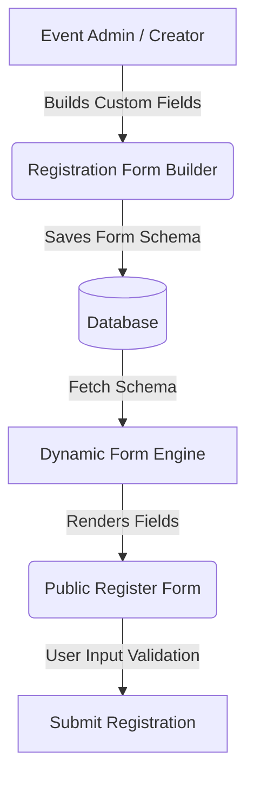

# JAZ Web Application Form Systems Documentation

This document provides a comprehensive overview of the forms, input architectures, dynamic layouts, and validation mechanisms implemented across the **JAZ** web platform.

---

## 1. Core Architectural Infrastructure

The application leverages a modular, reusable form architecture that supports both standard forms (e.g., login, contact) and complex, user-customizable dynamic forms.

### A. Dynamic Form Engine (`components/shared/dynamic-form.tsx`)
A powerful React component capable of rendering any custom list of fields (`FormField[]`) dynamically with high performance and accessibility.
* **Layout Modes**: 
  - `default`: Renders fields in a standard, modern, responsive layout.
  - `sector-elegant`: A premium multi-step wizard designed for complex registrations (e.g., visa or sector-specific requests).
* **Divided Sections in Elegant Mode**:
  1. **Personal Information** (`full_name`, `surname`, `sex`, `date_of_birth`, etc.)
  2. **Passport Documents** (`type_of_travel_document`, `number_of_travel_document`, etc.)
  3. **Residence Information** (`residence_in_other_country`, `residence_permit_number`, etc.)
  4. **Additional Information** (`fingerprints_collected_previously`, `previous_visa_number_if_known`, etc.)
  5. **Company Information** (`company_name`, `position_in_company`, `company_website`, etc.)
* **Features**:
  - Full micro-animations powered by **Framer Motion** for state and view transitions.
  - Localized fields supporting instantaneous swapping between **English** and **Arabic (RTL)**.

### B. Registration Form Builder (`components/shared/registration-form-builder.tsx`)
Empowers administrators to design custom attendance-gathering sheets for individual events.
* **Capabilities**:
  - Add, reorder, delete custom fields dynamically.
  - Field types supported: `text`, `textarea`, `number`, `email`, `date`, and `select` (Dropdown).
  - Customize localized labels (`label_ar` and `label_en`) and set validation requirements (`required` checkbox).
  - Includes a quick-populate helper to automatically append **all 18 Governorates of Iraq** (`بغداد`, `البصرة`, `نينوى`...) as selection options.

---

## 2. Forms Across the Application

Below are the primary static and user-facing forms used for general operation and management:

### 1. Contact Us Form (`app/contact/page.tsx`)
A public-facing communication form allowing users to directly reach the JAZ administrators.
* **Fields**: Name, Email, Subject, Message.
* **Aesthetics**: Glassmorphism/modern Tailwind border styles, responsive side-by-side card layouts, smooth focus ring indicators, and elegant loading states.

### 2. User Authentication Forms
* **Admin Login (`app/admin-login/page.tsx`)**: High-security, sleek, isolated credentials input layout with inline error notifications.
* **General User Login (`app/auth/login/page.tsx`)**: Secure login form with redirect capabilities.
* **User Registration (`app/auth/register/page.tsx`)**: Sign up forms for members, including fields validation and authentication callbacks.

### 3. Events & Content Administration
* **New / Edit Event Forms (`app/dashboard/events/new/page.tsx` & `edit/page.tsx`)**: Fully featured content forms used by administrators to specify title, categories, event dates, descriptions, custom banners, and combine the **Registration Form Builder** schemas.
* **Event Filters Form (`app/events/events-filter.tsx` / `events-filters.tsx`)**: Inline search query fields, selectors for dates, and interactive sorting criteria.
* **Partner & Partner Categories Forms (`app/dashboard/partners/page.tsx`)**: Manages partnerships, sponsor packages, registration schemes, and opportunity options.

### 4. Sector Registration Form (`app/sectors/components/sector-registration-form.tsx`)
A premium, highly detailed entry registration layout dedicated to professional economic sectors in the JAZ platform.
* **Component Flow & Design**:
  - Seamlessly checks for a custom database configuration (`config: FormField[]`) or falls back to the robust, comprehensive standard `getSectorRegistrationFallback()` schema.
  - Supports a premium `plain` variant displaying an "Official Dossier" / "استمارة رسمية" badge alongside 5 visually styled layout cards detailing each section's purpose.
  - Leverages `<DynamicForm variant="sector-elegant" />` to execute the multi-step registration wizard.
* **Backend Integration (`app/sectors/actions.ts`)**:
  - The `submitSectorRegistration` server action parses candidate names, emails, and phones from dynamic keys (e.g. `given_name`, `personal_email_address`, `personal_telephone`).
  - Records the registration with a status of `pending` in the Supabase `sector_registrations` table.
  - Automatically fires beautifully formatted confirmation emails to the registering user.
  - Sends immediate notifications to the JAZ admin email (`jaz.registr@gmail.com`) containing the full registration dossier.

---

## 3. Best Practices & Design Systems Applied

All forms strictly adhere to modern UX design principles:

| Rule / Feature | Implementation Detail |
| :--- | :--- |
| **Bi-directional Support** | Uses Tailwind's auto-direction formatting (`dir={dir}`) with complete Arabic translation files for clean RTL alignment. |
| **Accessibility (a11y)** | Labels are explicitly associated with input elements using `<Label htmlFor={...}>`. |
| **Interactive States** | Custom hover states, micro-transitions, active status animations, focus borders, and clean error highlights. |
| **Loading Indicators** | Disables action buttons during flight with dynamic `Loader2` spinners, preventing double submissions. |
| **Input Consistency** | Uniform border-radius, background layers, placeholder contrast, and typography throughout. |
