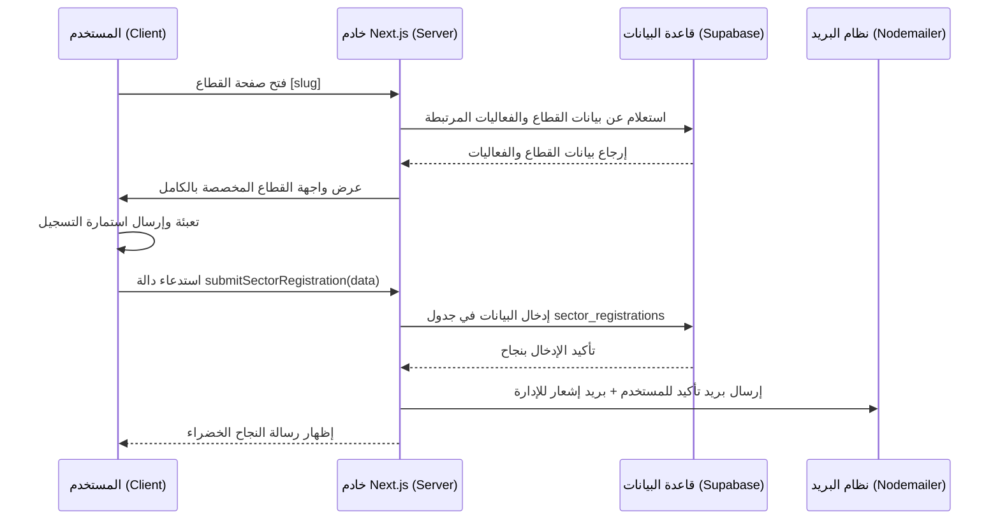

# توثيق صفحة القطاع التفصيلية (Sector Page Documentation)

هذا الملف يحتوي على شرح تفصيلي لهيكل، ومحتوى، ومكونات **صفحة القطاع التفصيلية** (وليس قسم القطاعات في الصفحة الرئيسية) في تطبيق **JAZ**. تم توثيق الملفات البرمجية المسؤولة عن الصفحة، الأقسام البصرية التي تتكون منها، الحقول المستخدمة في استمارة التسجيل، وتدفق البيانات.

---

## 📂 الملفات البرمجية المرتبطة بالصفحة

تتوزع الملفات البرمجية الخاصة بصفحة القطاع في المسار التالي:

1. **[app/sectors/[slug]/page.tsx](file:///Users/hasanainalmazrai/Desktop/ajz/app/sectors/[slug]/page.tsx)** (مكون خادم - Server Component):
   * يستقبل الرابط الديناميكي (`slug`) للقطاع.
   * يجلب بيانات القطاع من جدول `sectors` في قاعدة البيانات (Supabase).
   * يدمج بيانات قاعدة البيانات مع البيانات الثابتة الخاصة بالترجمة والمحتوى التفصيلي.
   * يجلب حتى 6 فعاليات منشورة (`published`) مرتبطة بهذا القطاع من جدول `events`.
   * يمرر البيانات إلى المكون العميل المسؤول عن العرض.

2. **[app/sectors/[slug]/sector-page-client.tsx](file:///Users/hasanainalmazrai/Desktop/ajz/app/sectors/[slug]/sector-page-client.tsx)** (مكون عميل - Client Component):
   * المكون الأساسي لعرض واجهة القطاع.
   * يتعامل مع اللغات (العربية والانجليزية) وتغيير اتجاه الصفحة (RTL/LTR).
   * يحتوي على الهيكل البصري، تأثيرات الخلفية، الأزرار التفاعلية، ونافذة التسجيل (Dialog).

3. **[app/sectors/sector-content.ts](file:///Users/hasanainalmazrai/Desktop/ajz/app/sectors/sector-content.ts)**:
   * يحتوي على النصوص الثابتة المترجمة للقطاعات الأربعة الرئيسية (العناوين، الأوصاف، الكلمات المفتاحية، اللون المميز لكل قطاع).
   * يحتوي على أسماء القطاعات البديلة (Aliases) لربط الروابط بالقطاع الصحيح.
   * يحتوي على إعدادات حقول استمارة التسجيل الافتراضية.

4. **[app/sectors/components/sector-registration-form.tsx](file:///Users/hasanainalmazrai/Desktop/ajz/app/sectors/components/sector-registration-form.tsx)**:
   * المكون الخاص باستمارة تسجيل القطاع.
   * يعرض تبويبات إرشادية وتفصيلية عن البيانات المطلوبة، ويستدعي النموذج الديناميكي (`DynamicForm`).

5. **[app/sectors/actions.ts](file:///Users/hasanainalmazrai/Desktop/ajz/app/sectors/actions.ts)** (أفعال الخادم - Server Actions):
   * دالة `submitSectorRegistration` التي تستقبل بيانات الاستمارة وتخزنها في جدول `sector_registrations`.
   * ترسل بريد إلكتروني تلقائي لتأكيد الاستلام للمستخدم، وإشعار بريد إلكتروني للإدارة (`jaz.registr@gmail.com`).

---

## 📐 الهيكل البصري وأقسام الصفحة (Page Structure)

تتكون صفحة القطاع من الأقسام التالية مرتبة من الأعلى إلى الأسفل:

### 1. مسار التصفح (Breadcrumb Navigation)
* يظهر أعلى الصفحة ليسهل على المستخدم التنقل والعودة.
* الهيكل: `الرئيسية / أقسامنا الاستراتيجية / [اسم القطاع الحالي]`.
* يدعم اللغتين العربية والانجليزية واتجاه النصوص المناسب.

### 2. القسم الرئيسي للقطاع (Hero Section)
يتميز هذا القسم بتصميم بصري فاخر ومظلم لجذب انتباه المستخدم:
* **صورة الغلاف الخلفية (Cover Image)**: يتم جلبها ديناميكياً من قاعدة البيانات، وتُعرض بنسبة شفافية منخفضة (35%) مع تدرج لوني داكن لضمان وضوح النصوص البيضاء فوقها.
* **الخلفية المتوهجة المخصصة**: تستخدم تأثير التوهج الشعاعي (Radial Gradient) المعتمد على **اللون المميز لكل قطاع** (Accent Color) ليمنح الصفحة طابعاً فريداً خاصاً بالقطاع المعروض.
* **أيقونة القطاع (Sector Icon)**: تُعرض داخل إطار ملون بشفافية مبنية على لون القطاع المميز.
* **شارة القسم الاستراتيجي (Strategic Division Badge)**: شارة مكتوب عليها "قسم استراتيجي" أو "Strategic Division".
* **العنوان الرئيسي (Title)**: اسم القطاع بخط عريض وحجم كبير جداً.
* **الوصف التفصيلي (Hero Description)**: نص تعريفي شامل عن مهام القطاع وأهدافه الاستراتيجية.
* **الكلمات المفتاحية (Keyword Chips)**: شارات تعرض المجالات الأساسية التي يغطيها القطاع (مثل: التميز السريري، الابتكار الصحي، إلخ).

### 3. أزرار التفاعل (Action Buttons)
توجد داخل قسم الـ Hero وتتكون من:
* **زر "فتح نموذج التسجيل" (Open Registration Form)**: عند الضغط عليه، تفتح نافذة منبثقة كاملة الشاشة (Full-screen Dialog) تحتوي على استمارة تقديم الطلب.
* **زر "استكشف الفعاليات" (Explore Events)**: زر شفاف (Ghost) ينقل المستخدم بتأثير تمرير سلس إلى قسم الفعاليات بالأسفل.

### 4. نافذة الاستمارة الرسمية (Registration Dossier Modal)
واجهة تسجيل متكاملة تفتح بشكل منبثق وتتميز بالتالي:
* **ترويسة رسمية**: تعرض شارات التقدم وحالة الاستمارة ("ملف رسمي" / "Official Dossier").
* **بطاقات إرشادية (Information Cards)**: توضح للمستخدم أقسام الاستمارة الخمسة قبل البدء في تعبئتها:
  1. **المعلومات الشخصية**: بيانات الهوية والتواصل الشخصي.
  2. **وثائق جواز السفر**: نوع الوثيقة ورقمها وتاريخ إصدارها وانتهائها.
  3. **معلومات الإقامة**: بلد الإقامة وتفاصيل تصريح الإقامة.
  4. **معلومات إضافية**: تفاصيل التأشيرات السابقة.
  5. **معلومات الشركة**: اسم المؤسسة وتخصصها وموقعها الجغرافي والإلكتروني.
* **النموذج الديناميكي (DynamicForm)**: يقوم بإنشاء الحقول تلقائياً وإدارتها مع التحقق من المدخلات (Validation).

### 5. قسم الفعاليات المرتبطة بالقطاع (Sector Events Section)
* **العنوان**: "الفعاليات ضمن هذا القسم" (Events in This Division).
* **زر "عرض الكل" (View All)**: ينقل المستخدم لصفحة الفعاليات العامة مع تصفية تلقائية للقطاع المختار (`/events?sector=[slug]`).
* **شبكة الفعاليات (Events Grid)**:
  * في حال وجود فعاليات: تُعرض في بطاقات (Cards) تفاعلية تحتوي على:
    * اسم الفعالية (يتحول لونه إلى لون القطاع المميز عند تمرير الفأرة فوقه).
    * شارة القسم الفرعي للفعالية (Sub-sector).
    * تاريخ الفعالية مع أيقونة التقويم (Calendar).
    * موقع الفعالية والدولة مع أيقونة الخريطة (MapPin).
  * في حال عدم وجود فعاليات: يظهر صندوق رمزي أنيق يوضح خلو القسم حالياً من الفعاليات المجدولة مع زر يدعوه لتصفح جميع الفعاليات الأخرى.

---

## 📝 محتوى القطاعات الأربعة الثابت (Sector Content Data)

تمت تهيئة 4 قطاعات أساسية في ملف الإعدادات `sector-content.ts` بالتفاصيل التالية:

| مفتاح القطاع (Key) | الاسم بالعربية | الاسم بالإنجليزية | اللون المميز (Accent) | التركيز الاستراتيجي (Scope) |
| :--- | :--- | :--- | :--- | :--- |
| `medical` | جاز للرعاية الصحية وعلوم الحياة | JAZ Healthcare and Life Sciences | `#b42318` (أحمر داكن) | التميز السريري، الابتكار الصحي، الشراكات العالمية |
| `technology` | جاز للتحول الرقمي والتكنولوجيا | JAZ Digital Transformation and Technology | `#0f766e` (أخضر بترولي) | تكنولوجيا المؤسسات، البنية التحتية الرقمية، ابتكار تكنولوجيا المعلومات |
| `academia` | جاز للشؤون المهنية والأكاديمية | JAZ Professional and Academic Affairs | `#4338ca` (أزرق نيلي) | الشراكات الأكاديمية، البحث العلمي، التطوير المهني |
| `industrie` | جاز للتطوير الصناعي والتجاري | JAZ Industrial and Commercial Development | `#9a3412` (برتقالي محروق/بني) | الابتكار الصناعي، التوسع التجاري، التوريد العالمي |

---

## 🔄 تدفق البيانات وحفظ الطلبات (Data Flow)

### تفاصيل حفظ البيانات:
* يتم حفظ الطلب في قاعدة البيانات بالحالة الافتراضية `pending` (قيد الانتظار).
* يتم حفظ كامل مدخلات الاستمارة الإضافية في حقل من نوع `JSON` يسمى `additional_info` لضمان عدم ضياع أي تفاصيل أدخلها المستخدم.
* يُرسل إشعار الإدارة فوراً إلى البريد المخصص للمراجعة والتدقيق.
